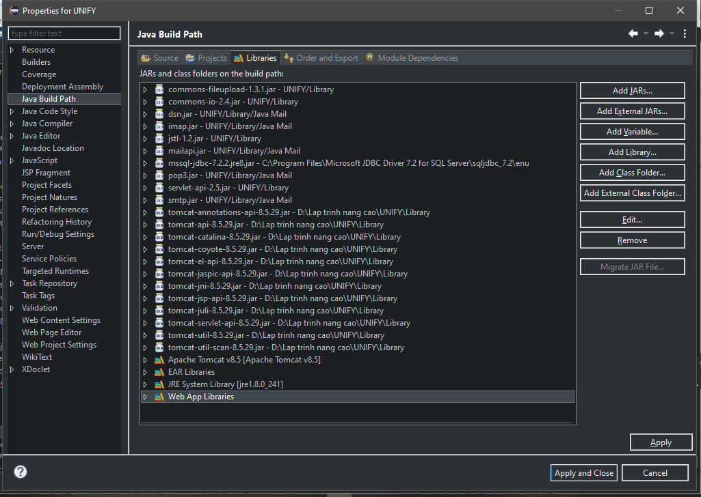
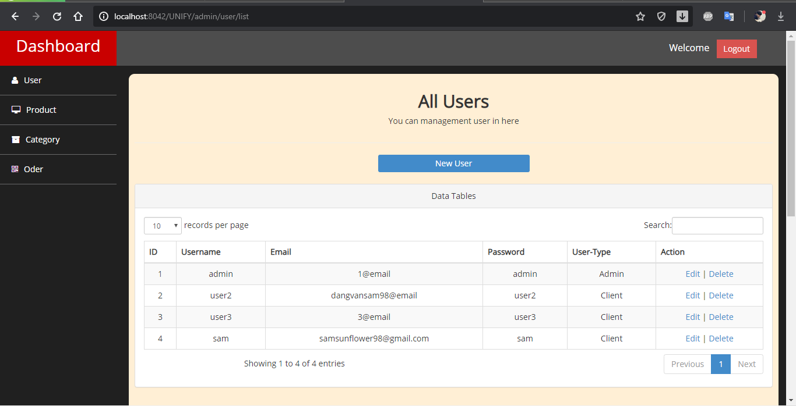
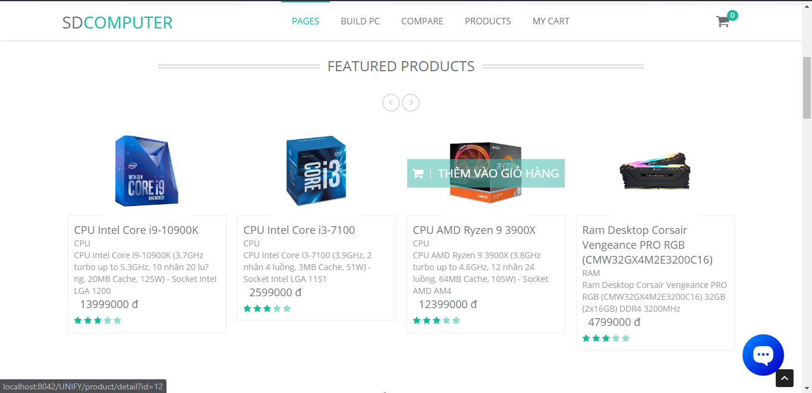
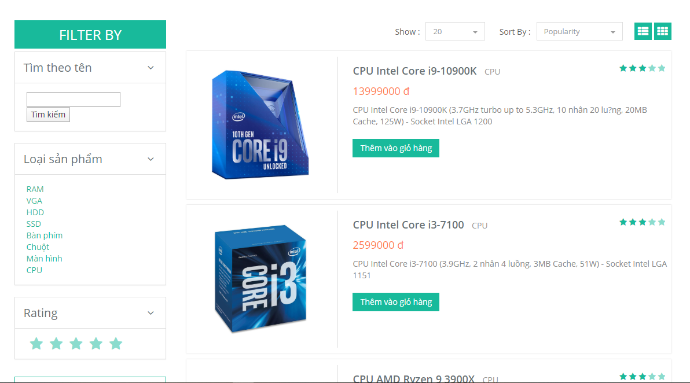
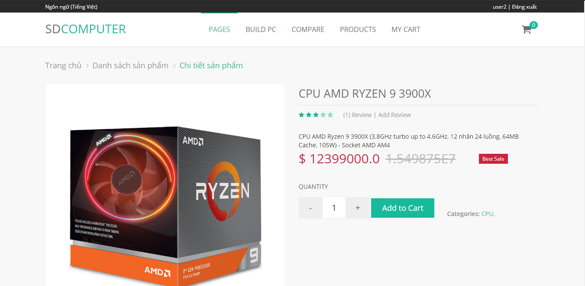

# LTNC-WebBanLinhKienMayTinh-Java
# Web bán linh kiện máy tính java: servlet + jsp + sqlserver

# Cài đặt:
+ Eclipse Neon
+ Tomcat 8.5
+ jdk1.8
+ jre1.8
+ jdbc7.2  
# Clone Project:
```
git clone https://github.com/dangvansam98/LTNC-WebBanLinhKienMayTinh-Java
```
# Database(SqlServer2014)
Tạo cơ sở dữ liệu bằng file script `create_unify_database_script` hoặc restore database từ file backup `sql-server-database-inserted-data_backupfile` 
# JDBC Driver
+ Copy file thư viện: `jstl-1.2.jar`, `mssql-jdbc-7.2.2.jre8`, các file `tomcat-...-8.5.29.jar` trong thư mục `Library` vào thư mục cài đặt Tomcat vd: `C:\Program Files\Apache Software Foundation\Tomcat 8.5_Tomcat85\lib\`  
+ Add các file jar như trong hình vào `classpath` trong Eclipse để chạy project.  
  
 *Chạy bằng Eclipse Neon*  
   
 

 
# Demo
+ Admin Dasboard  
  
   
+ Index  
  
 
+ List Product  
  
  
+ Product Detail  
  

